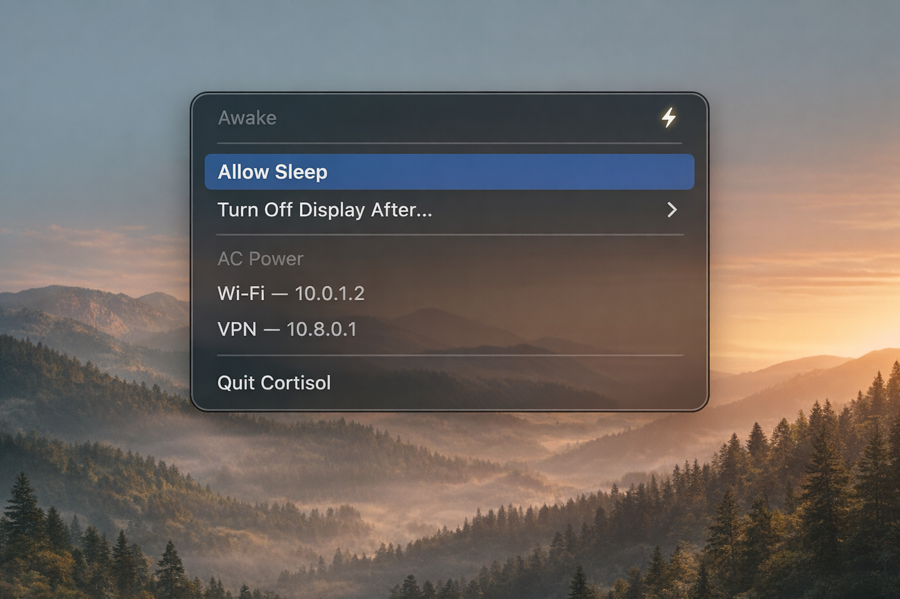

# Cortisol

A macOS menu bar app that prevents your Mac from sleeping — even when you close the lid. One click to keep awake, one click to restore. Shows power source and network info at a glance.

**[Download the latest release](https://github.com/ivorpad/cortisol/releases/latest)**

<!-- Screenshot placeholder: add screenshot.png to repo root -->
<!--  -->

## Features

- **Keep Awake** indefinitely or for 1, 2, 4, or 8 hours with a countdown timer in the menu bar
- **Power source** display (AC or battery percentage)
- **Network info** showing active interfaces with IP addresses (Wi-Fi, Ethernet, VPN)
- **Watchdog** safety net — if Cortisol is force-quit or crashes while keeping your Mac awake, a background agent restores normal sleep within 2 minutes
- **One-time setup** — authenticates once via Touch ID or password, then runs silently forever

## How it works

Cortisol lives in the menu bar with a bolt icon:

| Icon | State |
|---|---|
| ⚡ (filled) | Sleep is disabled — your Mac stays awake |
| ⚡ (slashed) | Normal behavior — sleep is enabled |

Click the icon to toggle sleep, set a timed session, or view system info. When a timer is active, the remaining time appears next to the icon in the menu bar.

Cortisol uses `pmset -a disablesleep` under the hood — the only macOS API that truly prevents sleep when the lid is closed. Alternatives like `caffeinate` only prevent idle sleep.

## First Launch

On first launch, Cortisol asks for administrator privileges via the standard macOS auth dialog (supports Touch ID). This installs a scoped sudoers entry so all future sleep toggling is passwordless — you only authenticate once.

## The Watchdog

Cortisol installs a LaunchAgent (`io.gradion.cortisol.watchdog`) that acts as a safety net for one scenario: **Cortisol is killed or crashes while sleep is disabled.**

Without it, force-quitting while awake would leave your Mac permanently unable to sleep until you manually run `sudo pmset -a disablesleep 0`.

### How it works

The watchdog runs every **120 seconds** via launchd:

1. **Check marker file** (`/tmp/cortisol-awake`) — if absent, exit immediately. Zero cost when Cortisol isn't keeping the Mac awake.
2. **Check if Cortisol is running** — if yes, exit.
3. **Check if sleep is disabled** — if not, clean up and exit.
4. **Cortisol is dead and sleep is stuck.** Try passwordless sudo to silently restore sleep.
5. **If passwordless sudo fails**, show a macOS dialog with a **Restore Sleep** button that prompts for admin credentials.

### Normal quit vs force quit

- **Quit from menu** — Cortisol re-enables sleep, removes the marker. The watchdog has nothing to do.
- **Force quit / crash / `kill -9`** — The marker persists. The watchdog detects Cortisol is gone and restores sleep automatically.

## Security

### Sudoers entry

Cortisol installs `/etc/sudoers.d/cortisol` granting passwordless sudo for exactly two commands:

```
<username> ALL=(ALL) NOPASSWD: /usr/bin/pmset -a disablesleep 0
<username> ALL=(ALL) NOPASSWD: /usr/bin/pmset -a disablesleep 1
```

Scoped as tightly as possible — only the `disablesleep` flag, nothing else.

### Why sudo?

`pmset -a disablesleep` requires root. There's no unprivileged API for this on macOS. The alternatives are worse:

- Prompting for credentials every time (bad UX)
- Running the whole app as root (bad security)
- Using `caffeinate` (doesn't prevent lid-close sleep)

### What to audit

| File | Purpose |
|---|---|
| `/etc/sudoers.d/cortisol` | Only persistent system change. Remove to revoke privileges. |
| `~/Library/LaunchAgents/io.gradion.cortisol.watchdog.plist` | Watchdog LaunchAgent. Remove to stop it. |
| `/tmp/cortisol-awake` | Ephemeral marker. Cleared on reboot. |

## Uninstall

```bash
# 1. Quit Cortisol from the menu bar
# 2. Remove the watchdog
launchctl unload ~/Library/LaunchAgents/io.gradion.cortisol.watchdog.plist
rm ~/Library/LaunchAgents/io.gradion.cortisol.watchdog.plist
# 3. Remove the sudoers entry
sudo rm /etc/sudoers.d/cortisol
# 4. Delete the app
```

## Build

Open `cortisol.xcodeproj` in Xcode and build. Requires macOS and Swift 5.9+/SwiftUI. No external dependencies.
